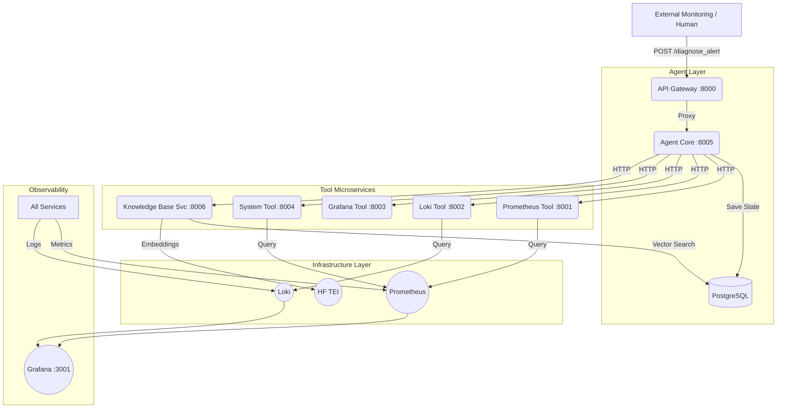
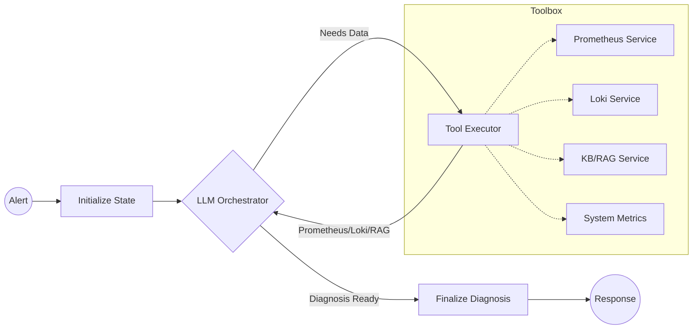

# Operations Diagnostic Platform - Production Monitoring Engine

This repository contains the **complete implementation** of Chapters 5 & 6, featuring a production-grade Operations diagnostic agent with comprehensive testing infrastructure.

## 🏗️ Architecture Overview

### System Architecture (Microservices)
The platform follows a distributed microservices pattern with full observability and testing coverage.



### Agent Logic (LangGraph Flow)
Inside the **Agent Core**, a stateful graph manages the diagnostic reasoning process:



## 🌟 Key Features

### Chapter 5: Microservices Architecture
- **Decoupling**: Tools are standalone APIs, independently scalable
- **Improved Reliability**: Circuit breakers and graceful degradation
- **Unified Entry Point**: API Gateway for simplified external integration
- **Independent Scaling**: Scale services based on specific load patterns

### Chapter 6: Production Testing & Validation
- **Comprehensive Test Suite**: Unit, Integration, E2E, Chaos, SLA, Performance
- **Golden Signals Monitoring**: Latency, Traffic, Errors, Saturation metrics
- **Performance Benchmarking**: p50/p95/p99 latency tracking
- **CI/CD Ready**: GitHub Actions workflow with local simulation
- **Chaos Engineering**: Automated resilience testing

## 🚀 Quick Start

### 1. Start the Platform
```bash
# Start all services (API Gateway, Agent Core, Tools, Monitoring)
docker compose up --build -d

# Wait for services to be ready (~30 seconds)
docker compose logs -f monitor-core
```

### 2. Load Sample Data
```bash
# Populate the knowledge base with historical incidents
docker compose run data-loader
```

### 3. Verify Installation
```bash
# Check all services are healthy
curl http://localhost:8000/health/mesh | jq

# Or use the verification script
python3 verify_microservices.py
```

### 4. Test a Diagnosis
```bash
# Send a test alert via API Gateway
curl -X POST http://localhost:8000/diagnose_alert \
  -H "Content-Type: application/json" \
  -d '{
    "alerts": [{
      "labels": {
        "alertname": "HighCPUUsage",
        "service": "news-classifier",
        "severity": "critical"
      },
      "annotations": {
        "summary": "CPU usage > 90%",
        "description": "CPU usage is critically high"
      }
    }]
  }' | jq
```

## 🧪 Testing & Validation

### Run All Tests
```bash
# Complete test suite (Unit + Integration + E2E + SLA)
./scripts/run_tests.sh

# With performance tests (optional, slower)
RUN_PERFORMANCE_TESTS=true ./scripts/run_tests.sh

# With soak tests (5+ minutes)
RUN_PERFORMANCE_TESTS=true RUN_SOAK_TESTS=true ./scripts/run_tests.sh
```

### Run Specific Test Categories
```bash
# Unit tests only (fast, no Docker required)
pytest tests/unit/ -v

# Integration tests (requires running services)
pytest tests/integration/ -v

# End-to-end tests
pytest tests/e2e/ -v

# SLA validation
pytest tests/sla/ -v

# Chaos engineering tests
pytest tests/chaos/ -v

# Performance tests
pytest tests/performance/ -v -m "not soak"

# Soak tests (long-running)
pytest tests/performance/ -v -m soak
```

### Performance Benchmarking
```bash
# Quick benchmark (10 requests, 2 concurrent)
python3 scripts/benchmark.py

# Load test (50 requests, 10 concurrent)
python3 scripts/benchmark.py --requests 50 --concurrency 10

# Custom output
python3 scripts/benchmark.py --output my_results.json
```

### CI/CD Validation
```bash
# Simulate GitHub Actions locally
./scripts/test_ci_locally.sh

# With integration tests
RUN_INTEGRATION=true ./scripts/test_ci_locally.sh
```

## 📊 Monitoring & Observability

### Service Endpoints

| Service | Health | Metrics | Port |
|---------|--------|---------|------|
| API Gateway | http://localhost:8000/health | http://localhost:8000/metrics | 8000 |
| Agent Core | http://localhost:8005/health | http://localhost:8005/metrics | 8005 |
| Prometheus Tool | http://localhost:8001/health | http://localhost:8001/metrics | 8001 |
| Loki Tool | http://localhost:8002/health | http://localhost:8002/metrics | 8002 |
| Grafana Tool | http://localhost:8003/health | http://localhost:8003/metrics | 8003 |
| System Tool | http://localhost:8004/health | http://localhost:8004/metrics | 8004 |
| Knowledge Base | http://localhost:8006/health | http://localhost:8006/metrics | 8006 |

### Dashboards
- **Grafana**: http://localhost:3001 (admin/admin)
- **Prometheus**: http://localhost:9090
- **LangSmith Tracing**: https://smith.langchain.com/

### Golden Signals Metrics
All services expose Prometheus metrics:
- **Latency**: `*_request_latency_seconds` (histogram)
- **Traffic**: `*_requests_total` (counter)
- **Errors**: `*_requests_total{http_status="5xx"}` (counter)
- **Saturation**: `process_resident_memory_bytes`, `python_gc_*`

## 🛠️ Configuration

### Environment Variables
Create a `.env` file (or copy from `.env.example`):

```env
# LLM Configuration
GROQ_API_KEY=your_groq_api_key_here
LLM_MODEL=llama-3.3-70b-versatile

# Deployment Mode
DEPLOYMENT_MODE=microservices
ENABLE_RAG_TOOL=true

# Embedding Provider
EMBEDDING_PROVIDER=huggingface
EMBEDDING_MODEL=BAAI/bge-small-en-v1.5

# Database
POSTGRES_USER=ops_user
POSTGRES_PASSWORD=ops_password
POSTGRES_DB=ops_db
POSTGRES_HOST=postgres
POSTGRES_PORT=5432

# Monitoring
PROMETHEUS_URL=http://prometheus:9090
LOKI_URL=http://loki:3100
GRAFANA_URL=http://grafana:3000
```

### Git Hooks (Recommended)
```bash
# Install git hooks for clean workspace transitions
bash scripts/setup-git-hooks.sh
```

## 📚 Documentation

### Chapter-Specific Guides
- **Chapter 5**: [Microservices Architecture](en/chapter-5/README.md)
- **Chapter 6**: [Production Testing](en/chapter-6/README.md)
  - [Quick Reference](en/chapter-6/QUICK_REFERENCE.md)
  - [Implementation Summary](en/chapter-6/IMPLEMENTATION_SUMMARY.md)
  - [Exercise 1: Unit Tests](en/chapter-6/exercises/exercise_1_unit_tests.md)
  - [Exercise 2: Chaos Engineering](en/chapter-6/exercises/exercise_2_chaos_engineering.md)
  - [Exercise 3: SLA Validation](en/chapter-6/exercises/exercise_3_sla_validation.md)

### Test Documentation
- [Performance Tests README](tests/performance/README.md)
- [Test Fixtures](tests/fixtures/)
- [Shared Test Configuration](tests/conftest.py)

## 🔧 Common Commands

### Service Management
```bash
# Start services
docker compose up -d

# Rebuild after code changes
docker compose up -d --build

# View logs
docker compose logs -f

# Stop services
docker compose down

# Clean restart
docker compose down --remove-orphans
docker compose up -d --build
```

### Debugging
```bash
# Check service status
docker compose ps

# View specific service logs
docker logs monitor-core -f
docker logs gateway -f

# Execute command in container
docker exec -it monitor-core bash

# Monitor resource usage
docker stats
```

### Makefile Shortcuts
```bash
# Start everything
make up

# Check status
make status

# Run a diagnosis
make diagnose

# View logs
make logs

# Clean restart
make restart
```

## 🧪 Test Coverage

| Category | Tests | Status |
|----------|-------|--------|
| Unit | 4 | ✅ PASSING |
| Integration | 4 | ✅ PASSING |
| E2E | 2 | ✅ PASSING |
| Chaos | 1 | ✅ READY |
| SLA | 2 | ✅ READY |
| Performance | 5 | ✅ READY |

**Total Test Coverage**: 18 automated tests

## 🚨 Troubleshooting

### Services Not Starting
```bash
# Check for port conflicts
lsof -i :8000  # API Gateway
lsof -i :8005  # Agent Core

# Check Docker resources
docker system df
docker system prune  # Clean up if needed
```

### Tests Failing
```bash
# Ensure services are running
docker compose ps

# Check service health
curl http://localhost:8000/health/mesh

# View recent logs
docker compose logs --tail=50
```

### Performance Issues
```bash
# Check resource usage
docker stats

# View metrics
curl http://localhost:8005/metrics | grep -E "(latency|requests_total)"

# Run benchmark
python3 scripts/benchmark.py --requests 10
```

## 📈 CI/CD

### GitHub Actions
The repository includes a comprehensive CI/CD workflow:
- **Linting**: Code quality checks (black, isort, flake8)
- **Unit Tests**: Fast tests with coverage reporting
- **Validation**: Configuration and structure checks
- **Integration Tests**: Full stack tests (on main branch)

### Local CI Simulation
```bash
# Test what will run in GitHub Actions
./scripts/test_ci_locally.sh
```

## 🎓 Learning Path

1. **Start Here**: [Chapter 5 README](en/chapter-5/README.md)
2. **Understand Testing**: [Chapter 6 README](en/chapter-6/README.md)
3. **Try Exercises**: [Chapter 6 Exercises](en/chapter-6/exercises/)
4. **Explore Code**: Start with `src/api_gateway/main.py`
5. **Run Tests**: `./scripts/run_tests.sh`
6. **Benchmark**: `python3 scripts/benchmark.py`

## 🔮 Future Improvements

The following features are planned or available for further implementation:

- **LangGraph Checkpoint Metrics**: The `LangGraph Checkpoints - PostgreSQL Health` Grafana dashboard exists but requires instrumentation. To enable it, add Prometheus metrics in `src/ops_agent_monitor/` to track:
  - Checkpoint save/load counts
  - Checkpoint sizes
  - Active thread counts
  
- **Distributed Tracing**: Add OpenTelemetry instrumentation for cross-service request tracing

- **Advanced Chaos Tests**: Network partition simulation, gradual degradation scenarios

- **Multi-LLM Support**: Fallback to alternative LLM providers when primary is rate-limited

## 🤝 Contributing

This is an educational repository. For improvements:
1. Fork the repository
2. Create a feature branch
3. Run tests: `./scripts/test_ci_locally.sh`
4. Submit a pull request

## 📄 License

Created as part of the AI Agents MLOps Course by DataScientest.

---

**Ready to get started?** Run `docker compose up -d` and explore! 🚀
